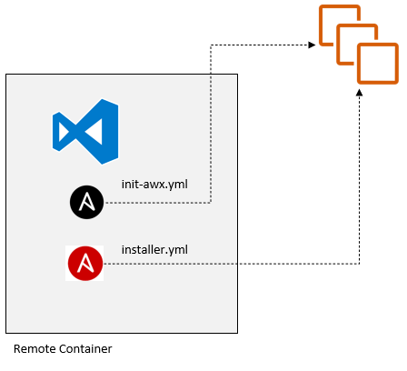

# AWX HA

1. AWXホスト用のSSH鍵をsshフォルダに配置
2. VSCodeのRemote Containerを起動します。
3. AWX用のホストを準備します。
4. inventoryファイルのホストIPとホスト名を修正します。<br/>
    コンテナ型のPostgreSQLを必要な場合は、ホスト名awxdb（ホスト名変更不可）をコメント解除してください。<br/>
    その場合はinit-awx.ymlの`POSTGRES_xxx`の環境変数を後述のインストーラのinventory変数に合わせて修正してください。<br/>
5. `/tmp/awx/installer/inventory`の下記の各種変数を環境に合わせて修正（その他は任意）<br/>
    - towerグループのホスト名とホストIP(DBは不要、そのほかは前述と同じ)
    - ansible_user
    - ansible_ssh_private_key_file
    - pg_hostname
    - admin_password
6. AWXホストを初期化
    ```
    > ansible-playbook -i inventory init-awx.yml
    ```
7. AWXのインストール
    ```
    > cd /tmp/awx/installer
    > ansible-playbook -i inventory install.yml
    ```

# 構成

